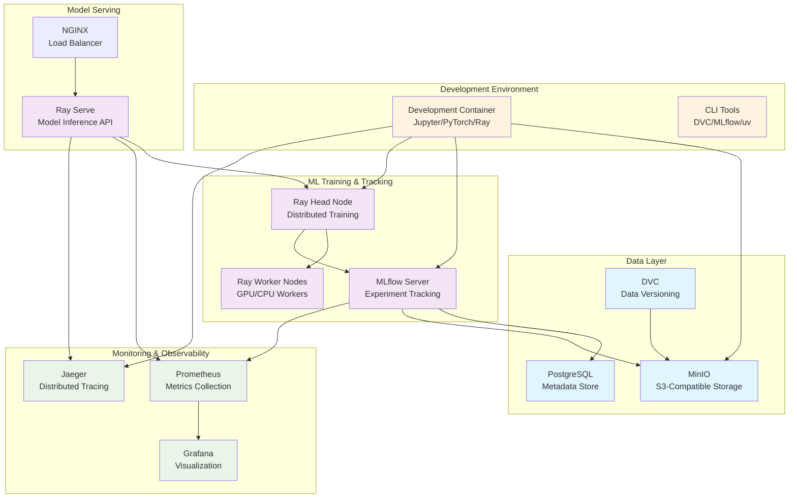

# End-to-End Machine Learning Lifecycle Architecture

## System Overview

This project simulates a complete ML lifecycle using containerized services to replicate cloud-native ML operations. The architecture emphasizes scalability, monitoring, and best practices for production ML systems.

## Core Components

### 1. Data Management Stack
- **MinIO**: S3-compatible object storage for datasets, models, and artifacts
- **PostgreSQL**: Relational database for MLflow metadata and experiment tracking
- **DVC**: Data versioning and pipeline orchestration

### 2. ML Training & Experimentation
- **MLflow**: Centralized experiment tracking, model registry, and artifact management
- **Ray Cluster**: Distributed computing for training and hyperparameter tuning
- **PyTorch/TensorFlow**: Deep learning frameworks

### 3. Model Serving & Inference
- **Ray Serve**: Scalable model serving with automatic scaling
- **NGINX**: Load balancing and API gateway functionality

### 4. Monitoring & Observability
- **Prometheus**: Metrics collection from all services
- **Grafana**: Visualization dashboards for system and ML metrics
- **Jaeger**: Distributed tracing for request flow analysis

### 5. Development Environment
- **Custom Container**: Unified development environment with all ML tools
- **CLI Integration**: Seamless integration with DVC, MLflow, and Ray

## Key Design Principles

### Scalability
- **Horizontal Scaling**: Ray cluster can dynamically add/remove workers
- **Resource Isolation**: Each service runs in dedicated containers
- **Load Balancing**: NGINX distributes inference requests across Ray Serve replicas

### Reproducibility
- **Data Versioning**: DVC tracks dataset changes and transformations
- **Experiment Tracking**: MLflow captures all hyperparameters, metrics, and artifacts
- **Environment Versioning**: Docker containers ensure consistent environments

### Observability
- **Comprehensive Monitoring**: All services expose Prometheus metrics
- **Distributed Tracing**: Request flows tracked across service boundaries
- **Centralized Logging**: Structured logs aggregated for analysis

### Production Readiness
- **Health Checks**: All services implement health endpoints
- **Graceful Degradation**: Services handle failures without cascading issues
- **Security**: Network isolation and authentication between services

## Data Flow Architecture

### Training Pipeline
1. **Data Ingestion**: Raw data uploaded to MinIO via DVC
2. **Data Processing**: Distributed preprocessing using Ray
3. **Model Training**: Distributed training with automatic experiment logging
4. **Model Registration**: Trained models registered in MLflow with versioning
5. **Model Validation**: Automated testing and evaluation metrics

### Inference Pipeline
1. **Model Loading**: Ray Serve loads models from MLflow registry
2. **Request Processing**: NGINX routes requests to available Ray Serve replicas
3. **Prediction Generation**: Models process requests with automatic scaling
4. **Response Delivery**: Results returned with comprehensive monitoring

### Monitoring Pipeline
1. **Metrics Collection**: Prometheus scrapes metrics from all services
2. **Alerting**: Automatic alerts for system and ML performance issues
3. **Visualization**: Grafana dashboards show real-time system status
4. **Tracing**: Jaeger tracks request flows for debugging and optimization

## Service Communication

### Internal Network
- All services communicate via Docker internal networks
- Service discovery through Docker DNS
- Environment-specific configuration management

### External Access
- Development environment exposes necessary ports for debugging
- Production environment restricts external access to essential services only
- API Gateway (NGINX) provides single entry point for inference requests

## Deployment Strategies

### Development Mode
- All services run locally with development configurations
- Hot-reloading enabled for rapid iteration
- Debug ports exposed for troubleshooting

### Production Simulation
- Services configured with production-like settings
- Resource limits and health checks enforced
- Comprehensive monitoring and alerting enabled

This architecture provides a realistic simulation of cloud-native ML operations while maintaining simplicity for development and learning purposes.
