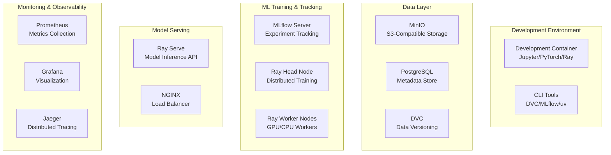

# End-to-End Machine Learning Lifecycle Simulation

A comprehensive simulation of production-grade ML operations using containerized services to replicate cloud-native machine learning workflows. This project demonstrates best practices for data versioning, distributed training, model serving, and observability.

## 🏗️ Architecture Overview

This project simulates a complete ML lifecycle with the following components:



## 🚀 Quick Start

### Prerequisites

- Docker & Docker Compose
- NVIDIA Docker (for GPU support)
- Git
- Python 3.11+
- `uv` package manager

### Setup Development Environment

1. **Clone the repository:**
   ```bash
   git clone <repository-url>
   cd e2e-ml
   ```

2. **Run the setup script:**
   ```bash
   python scripts/dev_setup.py
   ```

3. **Start all services:**
   ```bash
   make dev-up
   ```

4. **Access the interfaces:**
   - Jupyter Lab: http://localhost:8888
   - MLflow UI: http://localhost:5000
   - Ray Dashboard: http://localhost:8265
   - Grafana: http://localhost:3000
   - MinIO Console: http://localhost:9001

## 🗂️ Project Structure

```
e2e-ml/
├── .cursor/rules/              # Development rules and guidelines
├── configs/                    # Hydra configuration files
├── data/                       # Data storage (DVC tracked)
├── docs/                       # Documentation
├── models/                     # Saved models (DVC tracked)
├── notebooks/                  # Jupyter notebooks
├── scripts/                    # Automation scripts
├── src/                        # Source code
│   ├── data/                   # Data processing modules
│   ├── models/                 # Model definitions
│   ├── training/               # Training pipelines
│   ├── serving/                # Model serving
│   └── monitoring/             # Observability tools
├── tests/                      # Test suites
├── docker-compose.yml          # Production services
├── docker-compose.dev.yml      # Development overrides
├── Dockerfile.dev              # Development container
├── Makefile                    # Automation commands
└── pyproject.toml              # Python dependencies
```

## 🔧 Core Components

### 1. Data Management
- **MinIO**: S3-compatible object storage for datasets and models
- **DVC**: Data versioning and pipeline orchestration
- **PostgreSQL**: Metadata storage for MLflow

### 2. ML Training & Experimentation
- **MLflow**: Experiment tracking and model registry
- **Ray**: Distributed computing for training and hyperparameter tuning
- **PyTorch**: Deep learning framework with GPU support

### 3. Model Serving
- **Ray Serve**: Scalable model serving with auto-scaling
- **NGINX**: Load balancing and API gateway

### 4. Monitoring & Observability
- **Prometheus**: Metrics collection from all services
- **Grafana**: Visualization dashboards
- **Jaeger**: Distributed tracing for request flows

## 📋 Available Commands

### Development Operations
```bash
make dev-setup      # Setup development environment
make dev-up         # Start development services
make dev-down       # Stop development services
make dev-logs       # View service logs
```

### Code Quality
```bash
make test           # Run all tests
make lint           # Run linting checks
make format         # Format code
make clean          # Clean temporary files
```

### Data Operations
```bash
make data-pull      # Pull latest data from DVC
make data-push      # Push data changes to DVC
make data-status    # Check data status
```

### ML Operations
```bash
make train          # Run training pipeline
make evaluate       # Evaluate models
make serve          # Start model serving
```

## 🔬 ML Workflow Examples

### 1. Data Processing Pipeline
```python
from src.data.processing import DataPipeline
from pathlib import Path

# Initialize data pipeline
pipeline = DataPipeline(
    raw_data_path=Path("data/raw/images"),
    processed_data_path=Path("data/processed")
)

# Run preprocessing with DVC tracking
pipeline.run_with_dvc_tracking()
```

### 2. Distributed Training
```python
from src.training.distributed_trainer import DistributedTrainer
from src.models.classifier import ImageClassifier

# Setup distributed training
trainer = DistributedTrainer(
    model_class=ImageClassifier,
    num_workers=2,
    use_gpu=True
)

# Train with MLflow tracking
results = trainer.train_with_mlflow_tracking(
    experiment_name="image_classification_v1"
)
```

### 3. Model Serving
```python
from src.serving.deployment_manager import ModelDeploymentManager

# Deploy model with Ray Serve
manager = ModelDeploymentManager()
deployment_name = manager.deploy_model(
    model_name="image_classifier",
    model_version="latest",
    num_replicas=3
)
```

## 📊 Monitoring & Observability

### Key Metrics Tracked
- **Training Metrics**: Loss, accuracy, learning rate, epoch time
- **Serving Metrics**: Request rate, latency, error rate, throughput
- **Infrastructure Metrics**: CPU, memory, GPU usage, disk I/O
- **Business Metrics**: Model performance, data drift, prediction quality

### Available Dashboards
- **ML Training Dashboard**: Training progress and hyperparameter tracking
- **Model Serving Dashboard**: Inference performance and system health
- **Infrastructure Dashboard**: Resource utilization and service status
- **Data Quality Dashboard**: Data drift and quality metrics

## 🧪 Testing Strategy

### Test Categories
- **Unit Tests**: Individual component testing
- **Integration Tests**: Service interaction testing
- **End-to-End Tests**: Complete workflow validation
- **Performance Tests**: Load and stress testing

### Running Tests
```bash
# Run all tests
make test

# Run specific test categories
make test-unit
make test-integration
make test-e2e

# Run with coverage
pytest tests/ --cov=src --cov-report=html
```

## 🛡️ Security & Best Practices

### Security Measures
- Non-root container execution
- Secret management via environment variables
- Network isolation between services
- Input validation and sanitization
- Container vulnerability scanning

### Code Quality Standards
- Type hints for all functions
- Comprehensive docstrings (Google style)
- Pre-commit hooks for code quality
- Automated testing and coverage
- Code formatting with Ruff

## 📚 Documentation

 Detailed documentation is available in the `.cursor/rules/` directory:

- [Architecture Overview](.cursor/rules/architecture-overview.mdc)
- [Infrastructure & Containerization](.cursor/rules/infrastructure-containerization.mdc)
- [Data Pipeline & Versioning](.cursor/rules/data-pipeline-versioning.mdc)
- [ML Training & Experimentation](.cursor/rules/ml-training-experimentation.mdc)
- [Serving, Monitoring & Observability](.cursor/rules/serving-monitoring-observability.mdc)
- [Development Environment](.cursor/rules/development-environment.mdc)
- [Project Standards](.cursor/rules/project-standards.mdc)
 - [Dagster Orchestration](.cursor/rules/dagster-orchestration.mdc)

## 🤝 Contributing

 1. Follow the coding standards defined in `.cursor/rules/project-standards.mdc`
2. Write comprehensive tests for new features
3. Update documentation for significant changes
4. Use conventional commit messages
5. Ensure all pre-commit hooks pass

## 📄 License

This project is licensed under the MIT License - see the [LICENSE](LICENSE) file for details.

## 🆘 Support

For questions, issues, or contributions:

1. Check the documentation in `.cursor/rules/`
2. Review existing issues in the issue tracker
3. Create a new issue with detailed information
4. Follow the project's contribution guidelines

---

**Built with ❤️ for the ML community to demonstrate production-grade ML operations.**
